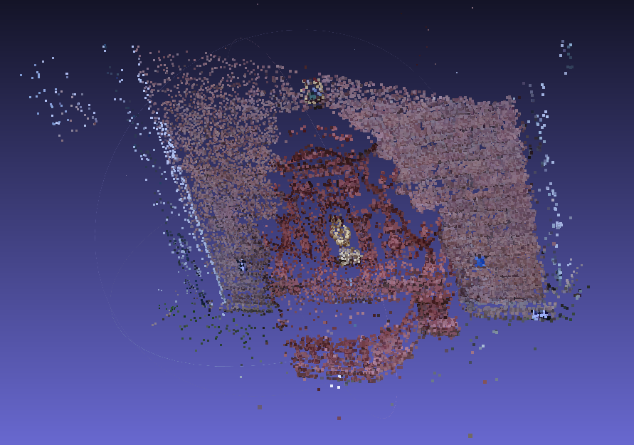

# Structure from Motion (SfM) Project



## Table of Contents
- [Overview](#overview)
- [Features](#features)
- [Installation](#installation)
- [Dataset Preparation](#dataset-preparation)
- [Usage](#usage)
  - [Running the SfM Pipeline](#running-the-sfm-pipeline)
- [Methodology](#methodology)
- [Dependencies](#dependencies)
- [Output](#output)
- [Contributing](#contributing)
- [License](#license)
- [Acknowledgements](#acknowledgements)

## Overview

This repository implements a **Structure from Motion (SfM)** pipeline to reconstruct 3D point clouds from a sequence of 2D images. The pipeline leverages feature detection, feature matching, camera pose estimation, triangulation, and point cloud visualization to generate a 3D representation of the observed scene.

**Key Capabilities:**
- **Feature Detection & Matching**: Utilizes SIFT and FLANN for robust feature extraction and matching.
- **Camera Pose Recovery**: Computes relative camera poses using the Essential Matrix.
- **Triangulation**: Reconstructs 3D points from matched features across image pairs.
- **Visualization**: Visualizes the reconstructed 3D point cloud using Open3D.
- **Point Cloud Saving**: Exports the point cloud in PLY format for further processing or visualization in tools like MeshLab.

## Features

- **Robust Feature Matching**: Employs SIFT features and FLANN-based matcher for accurate and efficient feature matching.
- **Pose Estimation**: Recovers camera rotation and translation between image pairs using the Essential Matrix.
- **3D Reconstruction**: Triangulates matched features to reconstruct 3D points.
- **Point Cloud Visualization**: Provides interactive 3D visualization of the reconstructed scene with color information.
- **Export Capability**: Saves the reconstructed point cloud in PLY format for compatibility with various 3D visualization and processing tools.
- **Error Handling**: Incorporates comprehensive error checks to ensure pipeline reliability.

## Installation

### Prerequisites

- **Python 3.7+**
- **Git** (for cloning the repository)

### Steps

1. **Clone the Repository**

    ```bash
    git clone https://github.com/MayankD409/Structure-From-Motion.git
    cd Structure-From-Motion
    ```

2. **Create a Virtual Environment (Optional but Recommended)**

    ```bash
    python3 -m venv venv
    source venv/bin/activate  # On Windows: venv\Scripts\activate
    ```

3. **Install Dependencies**

    ```bash
    pip install -r requirements.txt
    ```

    This command installs all necessary Python packages listed in `requirements.txt`.


### **Components:**

- **Images (`Data/`)**: A sequence of images capturing the scene from different viewpoints. For optimal results:
    - Ensure sufficient overlap between consecutive images.
    - Capture images with varying perspectives and orientations.
    - Maintain consistent lighting conditions to facilitate feature detection.

- **Calibration File (`K.txt`)**: Contains the camera intrinsic matrix. The expected format is a plain text file with nine numerical values representing the 3x3 matrix, separated by spaces or newlines.

    **Example Content of `K.txt`:**

    ```
    718.8560 0.0000 607.1928
    0.0000 718.8560 185.2157
    0.0000 0.0000 1.0000
    ```

    **Note:** Ensure that the calibration data is accurate and corresponds to the camera used to capture the images.

## Usage

### Running the SfM Pipeline

Execute the `main.py` script to start the SfM process. The script processes image pairs sequentially to reconstruct the 3D structure of the scene.

#### **Steps:**

1. **Navigate to the Project Directory**

    Ensure you're in the root directory of the project where `main.py` resides.

    ```bash
    cd Structure-From-Motion
    ```

2. **Run the Pipeline**

    Execute the following command, specifying the dataset directory:

    ```bash
    python Wrapper.py
    ```

3. **Monitor the Output**

    The script will process each image pair, displaying informative messages about each processing step. It will perform feature matching, pose recovery, triangulation, and visualize the reconstructed 3D point cloud.

4. **Visualize the Point Cloud**

    An interactive window will display the 3D point cloud. You can rotate, zoom, and pan to inspect the reconstruction.

5. **Save the Point Cloud**

    Upon completion, the script saves the point cloud as `output_with_colors.ply` in the project directory. This file can be opened with visualization tools like [MeshLab](https://www.meshlab.net/) or [CloudCompare](https://www.cloudcompare.org/).

    **Example Command:**

    ```bash
    python Wrapper.py
    ```

    **Output:**

    ```
    Intrinsic Matrix K:
    [[718.856 0.     607.1928]
     [0.     718.856 185.2157]
     [0.     0.      1.     ]]

    Processing image pair 1 and 2...
    Total matches found: 1500
    Good matches after ratio test: 1200
    Camera pose recovered.

    Triangulation completed.

    ...
    ```

    After processing all image pairs, you'll see:

    ```
    Total 3D points reconstructed: 500000
    Point cloud shape: (500000, 3)
    Color data shape: (500000, 3)

    Point cloud saved to output_with_colors.ply
    Structure from Motion pipeline completed successfully.
    ```

### **Parameters and Customization**

- **Feature Matching Parameters:**

    - **SIFT Features**: The number of SIFT features is set to 5000 for dense feature extraction. Adjust `nfeatures` in `feature_matching_and_display` for different requirements.

    - **FLANN Matcher Parameters**: The `algorithm` and `trees` parameters can be tuned for performance and accuracy. Refer to OpenCV's [FLANN Matcher documentation](https://docs.opencv.org/master/dc/dc3/tutorial_py_matcher.html) for more details.

- **Triangulation and Pose Recovery:**

    - **Essential Matrix Thresholds**: The `threshold` parameter in `findEssentialMat` influences the RANSAC threshold. Adjust based on the noise level in your dataset.

    - **Bundle Adjustment**: Currently implemented as a simple pose refinement using `solvePnP`. For more accurate reconstructions, consider integrating advanced bundle adjustment libraries like [Ceres Solver](http://ceres-solver.org/) or [g2o](https://github.com/RainerKuemmerle/g2o).

- **Visualization:**

    - **Point Cloud Colors**: The pipeline extracts BGR color information from the first image in each pair. Modify `extract_colors_from_image` if you wish to use different color extraction strategies.

    - **Point Cloud Density**: High-density point clouds may be computationally intensive. Adjust the number of features or implement point cloud filtering as needed.

## Methodology

The **Structure from Motion (SfM)** pipeline reconstructs a 3D structure from a series of 2D images by estimating camera poses and triangulating matched feature points. Here's a step-by-step overview of the process implemented in this project:

1. **Image Acquisition:**
    - Load a sequence of images capturing the scene from different viewpoints.
    - Read the camera intrinsic matrix from the calibration file (`K.txt`).

2. **Feature Detection and Matching:**
    - **Feature Detection**: Use SIFT to detect and describe features in each image.
    - **Feature Matching**: Utilize a FLANN-based matcher to find correspondences between features in consecutive image pairs.
    - **Lowe's Ratio Test**: Apply Lowe's ratio test to filter out unreliable matches.

3. **Camera Pose Recovery:**
    - **Essential Matrix Estimation**: Compute the Essential Matrix using matched feature points and RANSAC to handle outliers.
    - **Pose Decomposition**: Decompose the Essential Matrix to recover the relative rotation and translation between camera positions.

4. **Triangulation:**
    - **Projection Matrices Construction**: Build projection matrices for each camera pose.
    - **3D Point Triangulation**: Triangulate the matched feature points to obtain their 3D coordinates in space.

5. **Bundle Adjustment (Optional):**
    - **Pose Refinement**: Refine camera poses using `solvePnP` based on the 3D points and their 2D projections.
    - **3D Points Refinement**: Re-triangulate points using the refined poses for improved accuracy.

6. **Point Cloud Visualization:**
    - **Point Cloud Creation**: Aggregate all reconstructed 3D points.
    - **Color Mapping**: Assign color information to each 3D point based on the original image's color data.
    - **Interactive Visualization**: Use Open3D to visualize the 3D point cloud, allowing interactive inspection.

7. **Point Cloud Saving:**
    - **Export**: Save the reconstructed point cloud in PLY format for use in external visualization and processing tools.

## Dependencies

The project relies on the following Python libraries:

- **NumPy**: Fundamental package for numerical computations.
- **OpenCV (`opencv-python`)**: Computer vision library for image processing, feature detection, and matching.
- **Open3D**: Library for 3D data processing and visualization.
- **Matplotlib**: Plotting library for visualizations.
- **Glob**: File pattern matching utility.
- **Re**: Regular expressions for parsing calibration files.

### **Installing Dependencies**

All dependencies can be installed using the provided `requirements.txt` file.

```bash
pip install -r requirements.txt
